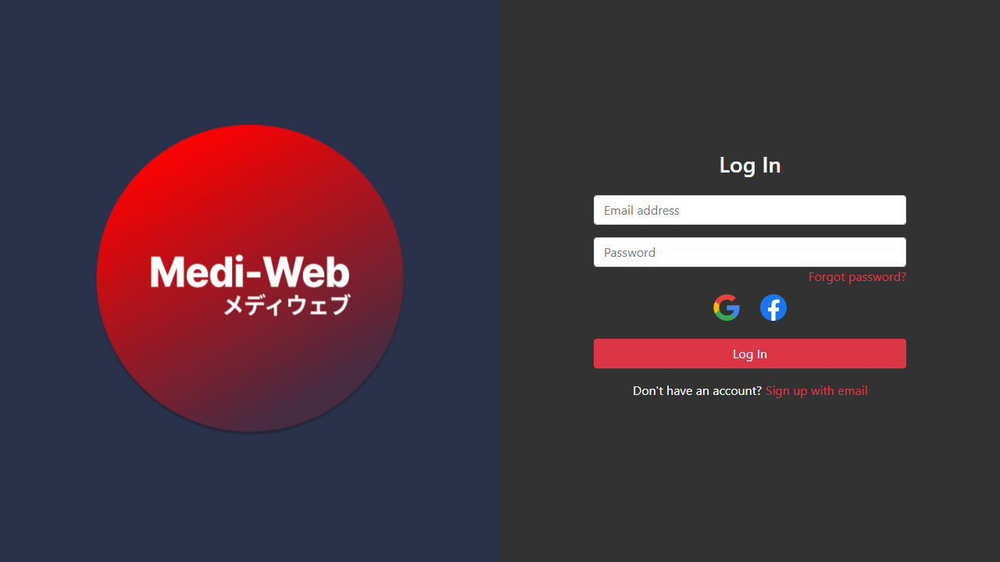
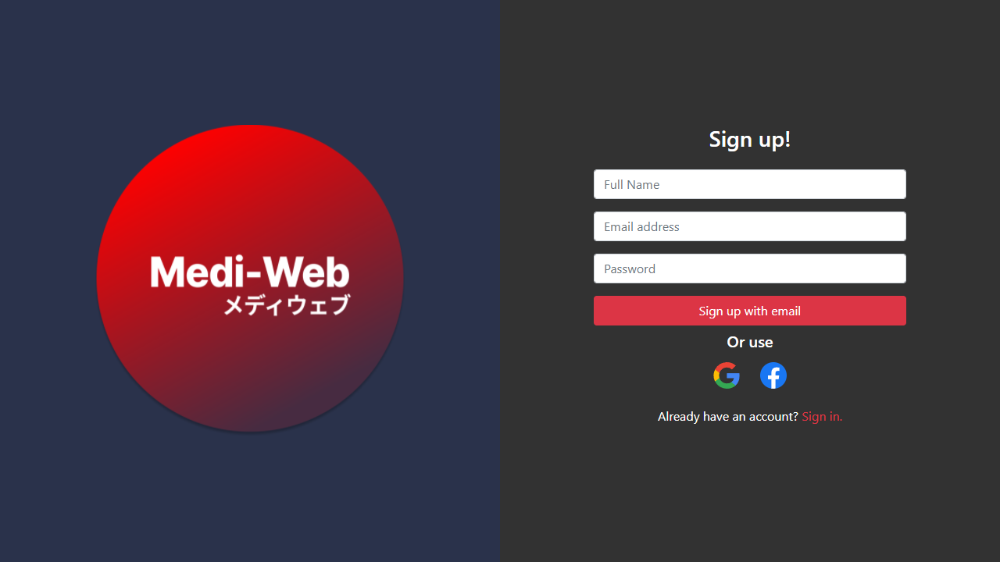
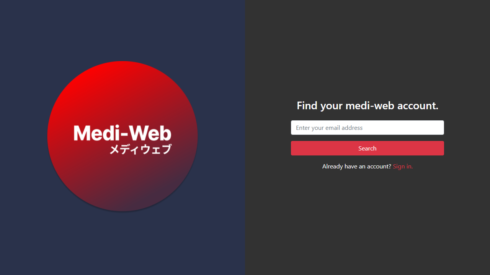

# Medi-Web

This project is part of [Medi Project MTU](https://github.com/medi-project-mtu).

## Outline

A societal transformation is taking place whereby healthcare professionals, and patients alike, are shifting from reactive
to predictive health care management. Rather than waiting for health problems to be manifested as life threatening
conditions, new AI technology enables prediction of future health problems using datasets of patient information.

The transformation in health care management, coupled with new machine learning models have created an opportunity
for your software development company to develop applications for this lucrative medical sector. The objective of your
start-up is to develop a bespoke system which predicts the likelihood of someone contracting the serious medical
conditions of heart disease, diabetes and Alzheimer’s.

Utility tokens are now frequently used to fund start-ups. As a method of fundraising your start-up, the team will use an
ICO (Initial Coin Offering) to develop a crypto utility token, Medi-Coin. This new crypto will be built on top of the
Ethereum blockchain and will be used to purchase services offered by Medi-Check.
The system consists of the key features outlined below.

## FEATURES
To develop the Medi-Check system, several applications are required:
* An android app, Medi-App, that enables patients and doctors, to calculate risk of illness based on lifestyle and
prior medical history
* A portal website, Medi-Web, for medical professionals.
* Machine learning models, based on internationally available medical datasets, will be developed to implement
the backend AI (Medi-predict).
* A simple blockchain and ICO

- - - -
# Current Features

## Login

> Email verification is currently setup and checked before login in.

## Sign Up

> An email with a link will automatically be sent upon successful registration to verify the account.

## Reset Password

- - - -
## Available Scripts

In the project directory, you can run:

### `npm start`

Runs the app in the development mode.\
Open [http://localhost:3000](http://localhost:3000) to view it in the browser.

The page will reload if you make edits.\
You will also see any lint errors in the console.

### `npm test`

Launches the test runner in the interactive watch mode.\
See the section about [running tests](https://facebook.github.io/create-react-app/docs/running-tests) for more information.

### `npm run build`

Builds the app for production to the `build` folder.\
It correctly bundles React in production mode and optimizes the build for the best performance.

The build is minified and the filenames include the hashes.\
Your app is ready to be deployed!

See the section about [deployment](https://facebook.github.io/create-react-app/docs/deployment) for more information.

### `npm run eject`

**Note: this is a one-way operation. Once you `eject`, you can’t go back!**

If you aren’t satisfied with the build tool and configuration choices, you can `eject` at any time. This command will remove the single build dependency from your project.

Instead, it will copy all the configuration files and the transitive dependencies (webpack, Babel, ESLint, etc) right into your project so you have full control over them. All of the commands except `eject` will still work, but they will point to the copied scripts so you can tweak them. At this point you’re on your own.

You don’t have to ever use `eject`. The curated feature set is suitable for small and middle deployments, and you shouldn’t feel obligated to use this feature. However we understand that this tool wouldn’t be useful if you couldn’t customize it when you are ready for it.
